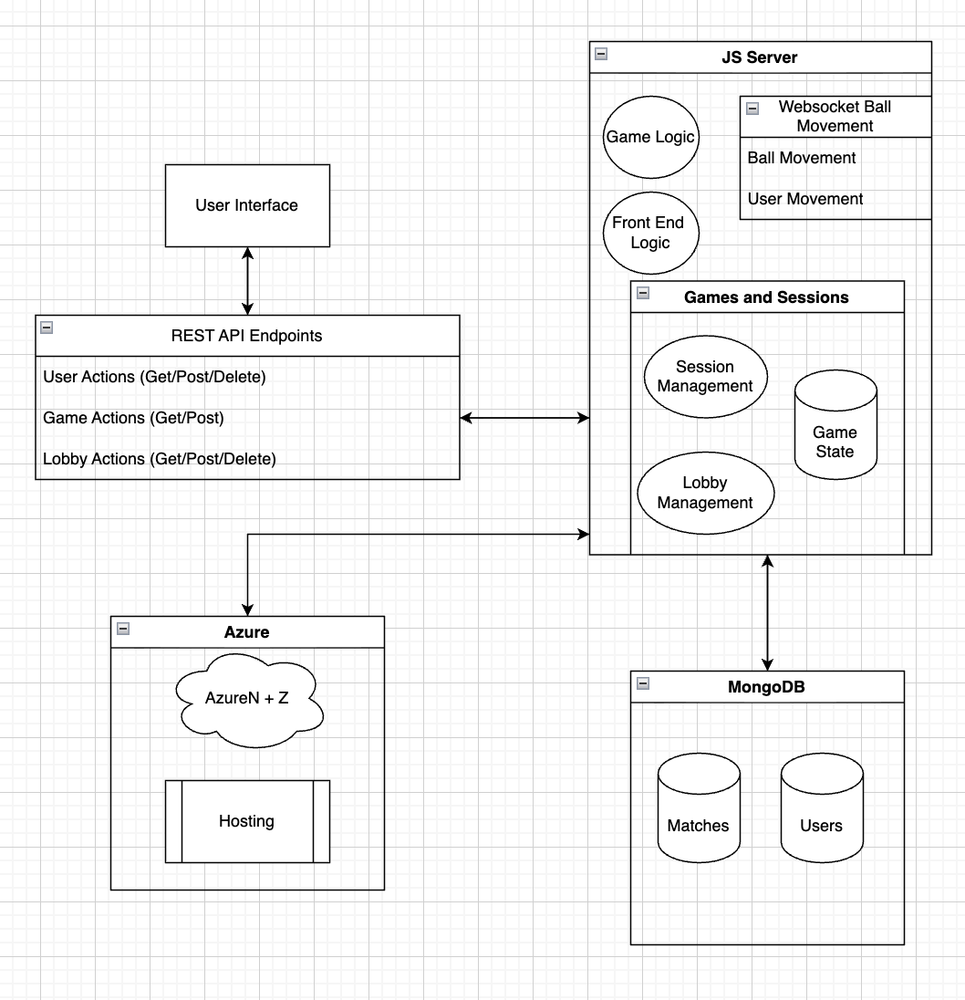
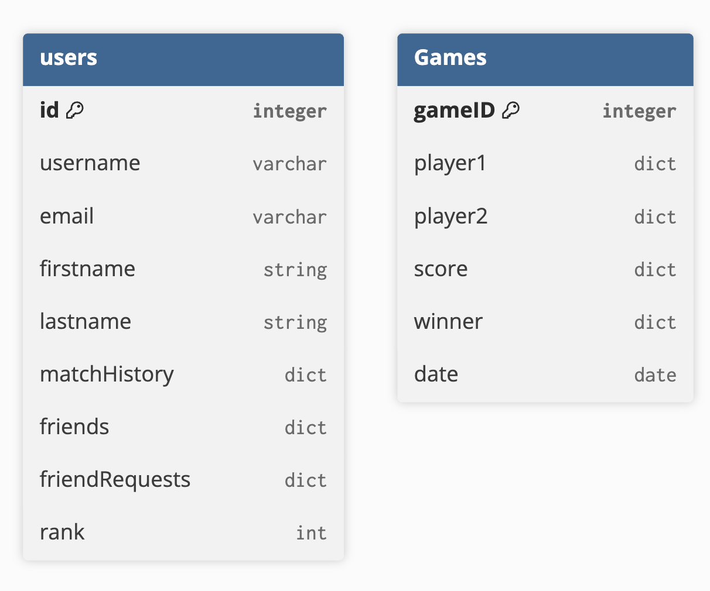

# Retro Arcade

## Overview

Retro Arcade is a virtual arcade-style web app where users can play classic retro games and compete against each other. Currently, the only game in scope is **Pong**, but additional games may be added depending on project scope.

This application is built for students and workers who need a quick break between classes or meetings. With short modern attention spans, we want to create a pick-up-and-put-down experience that delivers simple, low-effort fun while still providing a competitive edge. Leaderboards, friendly challenges, tournaments, and ranking systems help keep those two spare minutes engaging.

As developers, we’re excited to build an interactive online game that encourages quick bursts of fun and competition. This project also gives us the opportunity to learn new technologies such as game/state management and real-time interactivity using websockets.

Deployed web app: [https://retro-arcade-g6fnhabshze3ejeg.northcentralus-01.azurewebsites.net/](https://retro-arcade-g6fnhabshze3ejeg.northcentralus-01.azurewebsites.net/)

---

## Technical Description

---

## Database Schema

---

## User Stories
### Implemented:
| Priority | User | Description | Technical Implementation |
|---------|------|-------------|---------------------------|
| **P0** | As a player | I want to go to the website and start a new game | Publish the web app and implement create-game functionality. |
| **P0** | As a player | I want to press arrow keys to move my paddle | Implement paddle movement + UI state. |
| **P0** | As a player | I want to see the ball bounce and hit my paddle | Implement ball movement + collision logic. |
| **P0** | As a player | I want score tracking and win/loss behavior | Implement game logic + static “bot” opponent. |
| **P1** | As a player | I want to see my game history | Create Games table and update on match end. |
| **P2** | As a player | I want to add friends | Implement POST/GET endpoints for friend list. |
| **P2** | As a player | I want to remove friends | Implement POST/GET endpoints for friend list. |
| **P2** | As a player | I want to play against the eviluser (LAN) at the same time as my friend does on their computer| Implement sessions for simultaneous players. |
| **P2** | As a player | I want private lobbies to play with friends | Implement lobby logic + websockets. |
| **P2** | As a player | I want to earn ranking points | Add rank score field + update ranking logic. |
| **P3** | As a player | I want to join or start public lobbies | Implement lobby table and public lobby logic. |

### Unimplemented:
| Priority | User | Description | Technical Implementation |
|---------|------|-------------|---------------------------|
| **P1** | As a player | I want to log in and customize my username | Set up Azure Authentication and Users table. |
| **P2** | As a player | I want to rematch after game ends | Keep session active; allow rematching. |
| **P3** | As a player | I want to see my match record against a specific user | Store per-user opponent stats. |
| **P3** | As a player | I want to play ranked against players of similar skill | Implement ranked queue and rank-based lobbies. |
| **P3** | As a player | I want to play in a tournament | Implement tournament structuring across multiple lobbies. |

---

## Possible Endpoints

### **Authentication & Session Management**
- `POST /users` — Create a user account  
- `POST /session` — Log in  
- `DELETE /session` — Log out  

### **User Management**
- `GET /users/{id}` — Public profile  
- `GET /users/{id}/profile` — Detailed profile  
- `PATCH /users/{id}` — Update username/profile  
- `DELETE /users/{id}` — Delete account  

### **Friends Management**
- `GET /users/{id}/friends` — Get friends  
- `POST /users/{id}/friends` — Send friend request  
- `DELETE /users/{id}/friends/{friendId}` — Remove friend  

### **Match History & Stats**
- `GET /users/{id}/matches` — Match history  
- `GET /users/{id}/matches/{opponentId}` — Head-to-head record  
- `GET /users/{id}/stats` — Player stats  

### **Ranking & Leaderboards**
- `GET /users/{id}/rank` — User rank  
- `GET /leaderboard` — Global leaderboard  
- `GET /leaderboard/friends` — Friends leaderboard  

### **Lobby Management**
- `GET /lobbies` — All joinable lobbies  
- `GET /lobbies/{id}` — Lobby details  
- `GET /lobbies/public` — Public lobbies  
- `GET /lobbies/ranked` — Ranked matchmaking  
- `POST /lobbies` — Create a lobby  
- `POST /lobbies/{id}/join` — Join lobby  
- `PATCH /lobbies/{id}` — Update lobby settings  
- `DELETE /lobbies/{id}` — Delete lobby  
- `DELETE /lobbies/{id}/leave` — Leave lobby  
